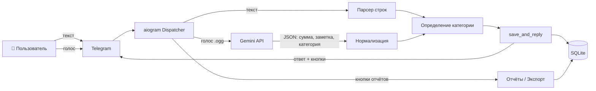
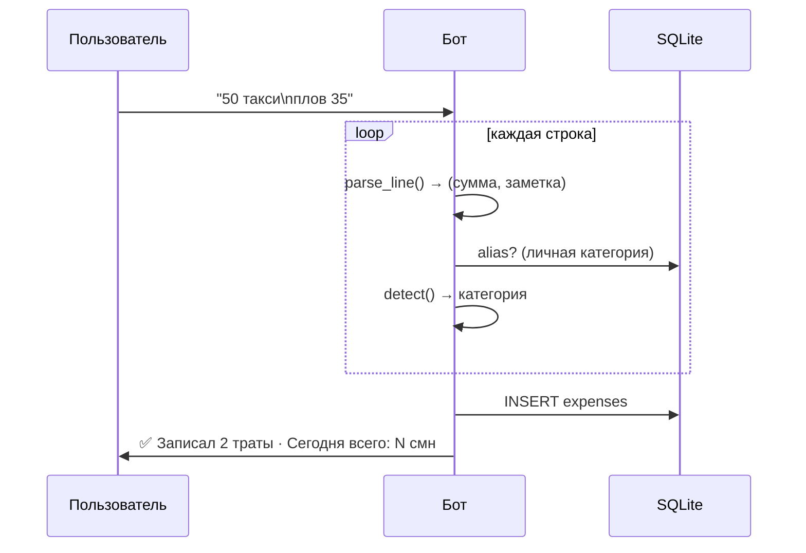
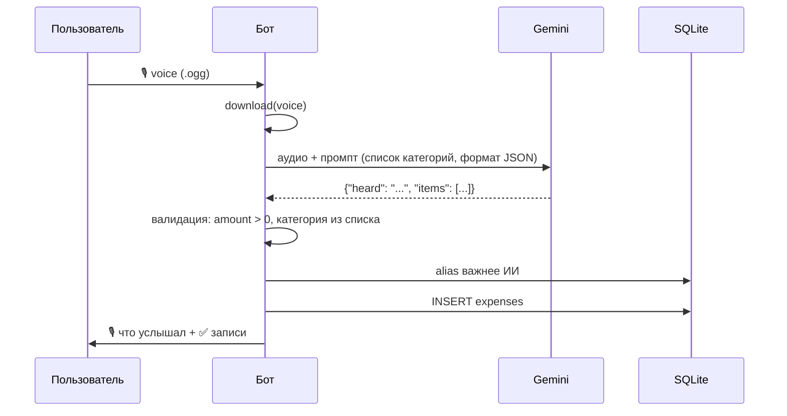
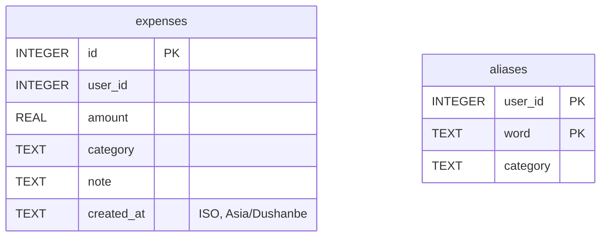

# 💰 Трекер расходов в Telegram — Архитектура

> Принцип: **просто = гениально**. Пользователь пишет или говорит — бот записывает. Никаких меню и форм.

---

## 1. Что умеет бот

| Функция | Как пользоваться |
|---|---|
| Запись текстом | `50 такси`, `плов 35`, `1.5к аренда`, `кофе 12,5` |
| Несколько трат сразу | Каждая трата — с новой строки |
| Запись голосом (ИИ) | «такси пятьдесят и плов тридцать пять» |
| Авто-категории | По ключевым словам + личные алиасы |
| Смена категории | Кнопка ✏️ → бот запоминает слово |
| Удаление | Кнопка 🗑 или «↩️ Отменить» (последняя) |
| Отчёты | 📊 Сегодня · 📆 Неделя · 📅 Месяц |
| Экспорт | 📤 CSV (открывается в Excel) |

---

## 2. Стек

| Слой | Технология | Почему |
|---|---|---|
| Язык | Python 3.11+ | Просто, быстро писать |
| Telegram | aiogram 3 | Асинхронный, современный |
| БД | SQLite | Один файл, без сервера |
| ИИ для голоса | Gemini (`google-genai`) | Понимает аудио напрямую, есть бесплатный тариф |
| Часовой пояс | `Asia/Dushanbe` | Корректные «сегодня/месяц» |
| Деплой | VPS + systemd или Docker | Бот работает 24/7 |

---

## 3. Общая схема



---

## 4. Поток: текстовое сообщение



## 5. Поток: голосовое сообщение



**Правило приоритета категорий:** личный алиас пользователя → категория от ИИ (если есть в списке) → ключевые слова → «📦 Другое».

---

## 6. База данных



- `expenses` — все траты. Каждый пользователь видит только свои (`WHERE user_id=?`).
- `aliases` — «обучение» бота: слово → категория, отдельно для каждого пользователя.

**Индекс (добавить при росте):**
```sql
CREATE INDEX IF NOT EXISTS idx_exp_user_date ON expenses(user_id, created_at);
```

---

## 7. Структура проекта

Сейчас всё в одном `bot.py` (~300 строк) — для контеста это нормально. Если будешь расширять, разбей так:

```
expense-bot/
├── bot.py               # точка входа: Bot, Dispatcher, start_polling
├── config.py            # BOT_TOKEN, GEMINI_API_KEY, TZ, MODEL
├── db.py                # подключение, схема, запросы
├── categories.py        # CATEGORIES, alias(), detect()
├── parser.py            # parse_line(), fmt()
├── ai.py                # запрос к Gemini, промпт, валидация JSON
├── keyboards.py         # MAIN, entry_kb(), клавиатура категорий
├── handlers/
│   ├── commands.py      # /start, /help
│   ├── reports.py       # сегодня / неделя / месяц / экспорт / отмена
│   ├── expenses.py      # текст → save_and_reply
│   ├── voice.py         # голос → Gemini → save_and_reply
│   └── callbacks.py     # ✏️ категория, 🗑 удалить
├── tests/
│   └── test_parser.py   # тесты parse_line и detect
├── requirements.txt
├── .env.example
├── Dockerfile
└── README.md
```

**Правило:** хендлеры тонкие, логика — в `parser.py`, `categories.py`, `ai.py`. Так её легко тестировать.

---

## 8. Ключевые функции

| Функция | Вход | Выход | Суть |
|---|---|---|---|
| `parse_line(line)` | `"1.5к аренда"` | `(1500.0, "аренда")` | Регэксп: число, `к/k` = ×1000, остальное — заметка |
| `alias(uid, note)` | заметка | категория или `None` | Личные привычки пользователя |
| `detect(uid, note)` | заметка | категория | alias → ключевые слова → «Другое» |
| `save_and_reply(m, items)` | `[(сумма, заметка, кат)]` | сообщение | **Единая точка** записи для текста и голоса |
| `report(uid, since, title)` | период | текст | Сумма, проценты, полоски ▓░ |
| `fmt(x)` | `1500.0` | `"1 500"` | Красивые числа |

---

## 9. Команды и кнопки

| Кнопка | Команда | Действие |
|---|---|---|
| — | `/start`, `/help` | Приветствие + подсказка |
| 📊 Сегодня | `/today` | Отчёт с 00:00 |
| 📆 Неделя | `/week` | Последние 7 дней |
| 📅 Месяц | `/month` | С 1-го числа |
| ↩️ Отменить | `/undo` | Удалить последнюю запись |
| 📤 Экспорт | `/export` | CSV со всеми тратами |

Callback-данные: `del:{id}`, `cat:{id}`, `set:{id}:{index}` (лимит Telegram — 64 байта, укладываемся).

---

## 10. Переменные окружения

```env
BOT_TOKEN=токен_от_BotFather
GEMINI_API_KEY=ключ_с_aistudio.google.com
GEMINI_MODEL=gemini-3.1-flash-lite   # опционально
DB_PATH=expenses.db                  # опционально
```

⚠️ `.env` — в `.gitignore`. Токены **никогда** не коммитить.

---

## 11. Запуск и деплой

**Локально:**
```bash
pip install -r requirements.txt
export $(cat .env | xargs) && python bot.py
```

**systemd на VPS** (`/etc/systemd/system/expense-bot.service`):
```ini
[Unit]
Description=Expense Telegram Bot
After=network.target

[Service]
WorkingDirectory=/opt/expense-bot
EnvironmentFile=/opt/expense-bot/.env
ExecStart=/opt/expense-bot/venv/bin/python bot.py
Restart=always
RestartSec=5

[Install]
WantedBy=multi-user.target
```
```bash
sudo systemctl enable --now expense-bot
journalctl -u expense-bot -f
```

**Docker:**
```dockerfile
FROM python:3.12-slim
WORKDIR /app
COPY requirements.txt .
RUN pip install --no-cache-dir -r requirements.txt
COPY . .
CMD ["python", "bot.py"]
```
База — через volume, чтобы не терялась: `-v ./data:/app/data -e DB_PATH=/app/data/expenses.db`.

---

## 12. Надёжность

- Ошибка Gemini → бот не падает, просит повторить или написать текстом.
- Ответ ИИ всегда валидируется: `amount > 0`, категория только из списка.
- SQL только с параметрами `?` — защита от инъекций.
- Пользовательский текст экранируется `html.escape` (parse_mode=HTML).
- Бэкап: раз в сутки копировать `expenses.db` (cron).

---

## 13. Идеи на развитие (по желанию)

1. **Лимиты:** `/limit еда 1000` → предупреждение при 80% и 100%.
2. **Доходы:** `+3000 зарплата` → баланс за месяц.
3. **Ежедневная сводка** в 21:00 (планировщик `apscheduler`).
4. **Графики** картинкой (matplotlib) в месячном отчёте.
5. **Общий бюджет семьи:** бот в группе, у всех общий учёт.
6. **Фото чека** → Gemini достаёт сумму и магазин.
7. **Язык интерфейса:** русский / тоҷикӣ.

---

## 14. Чек-лист перед сдачей на контест

- [ ] Бот работает 24/7 на VPS (живое демо)
- [ ] Публичный репозиторий на GitHub
- [ ] README: что это, скриншоты/GIF, ссылка на бота, как запустить
- [ ] `.env.example`, без реальных токенов
- [ ] Прогнал сценарии: текст, несколько строк, голос, ✏️, 🗑, отчёты, экспорт
- [ ] Короткое видео-демо 30–60 сек (голос + отчёт — это «вау»)
- [ ] Тесты для `parse_line` (плюс к оценке)

---

*Не ради результата, а ради процесса. Бисмиллях — и вперёд.* 🤲
